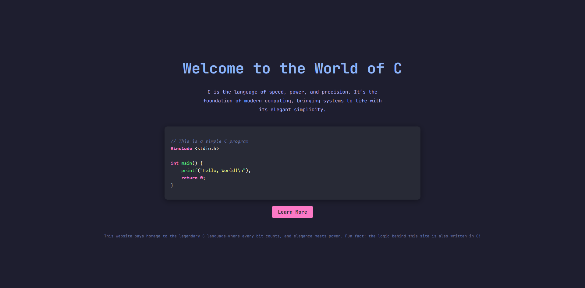

# Web Application
A simple web application on ~~Fortran~~ C for linux/unix.


##
### Philosophy

* The goal of this project is to understand whether the use of C language is relevant in web development

### How to run?

Use docker compose for deploy:

```bash
make run
```